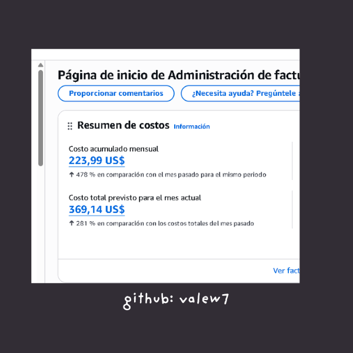
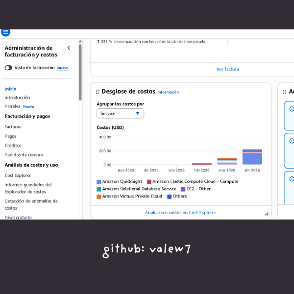
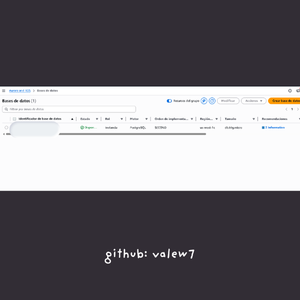
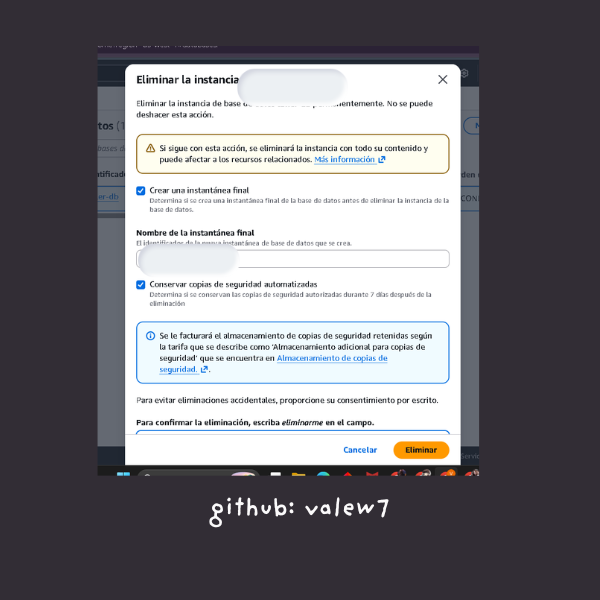
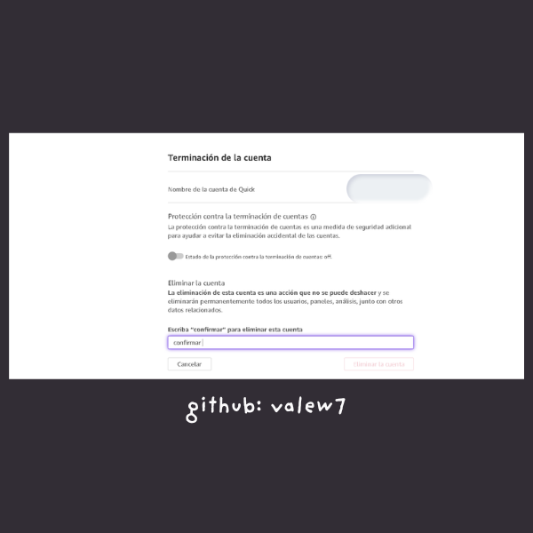
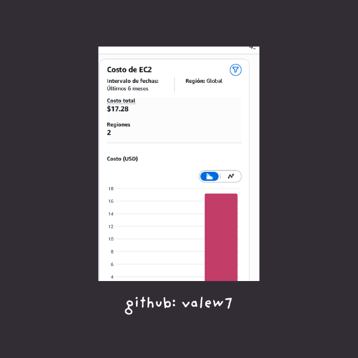

# AWS FinOps — Cost Reduction Case Study 💰

Real cost optimization audit on a production AWS account.
Reduced projected monthly spend from **$369/month to under $20/month**.

> All sensitive resource names have been redacted. Screenshots are real.

---

## The Problem

AWS bill was growing fast — **478% increase** month over month.
Projected cost for the month: **$369.14 USD**.

---

## Root Cause Analysis

Used AWS Cost Explorer to break down costs by service and identify the culprits.

**What was driving the cost:**
- Aurora PostgreSQL instance running 24/7 with no active workload
- Amazon QuickSight left active by mistake
- Unattached EBS volumes accumulating storage costs
- Multiple EC2 instances left running
- Elastic IP addresses not associated to any instance (AWS charges for unused EIPs)

---

## Actions Taken

### 1. Identified unattached EBS volumes
Found 3 volumes (10 GiB, 8 GiB, 26 GiB) not assigned to any instance.

### 2. Terminated Aurora DB instance
The RDS/Aurora instance was the largest cost driver.

### 3. Deleted QuickSight account
Activated by mistake — never used in production.

---

## Result

EC2 cost for the following 6 months: **$17.28 total**.

---

## Key Takeaways

- Always set **billing alerts** from day one
- Review Cost Explorer **weekly**, not monthly
- Unused resources cost money even if idle
- QuickSight, Elastic IPs, and snapshots are silent cost killers

---

Built by [@Valew7](https://github.com/Valew7)

## Tech Stack

